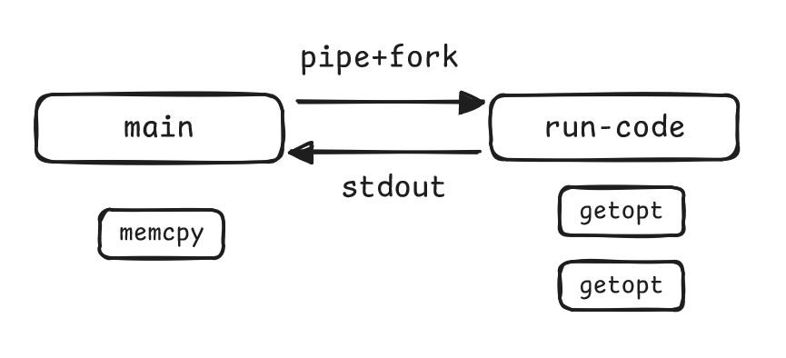

# getopt & config

No dependencies, only use system function to parse config.



- main process use `pipe` to receive STDOUT from subprocesses
- main process use `fork` to generate subprocess
- subprocess `unset` environment before `exec` shell process
- shell process call processes with options
- processes use `getenv` to tell which side they are
- processes use `getopt` to parse options and write result to STDOUT
- processes use `signal` to mark write done

## Example

```
$ PIPE_CONFIG=pipe.rc ./a.out
[client] alt: True , key: 6
[server] > read done, have read 1, size 2
[client] alt: True , key: b
[server] > read done, have read 2, size 2
[client] alt: False, key: 3
[server] > read done, have read 3, size 2
[server] > pipe close
[server] > all read done, have read 3 key config
```

## Tips

```
$ valgrind -q --trace-children=yes
```

